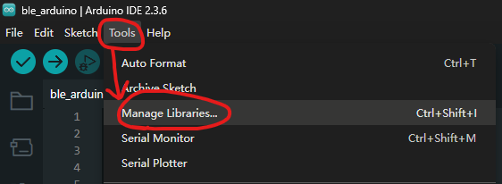
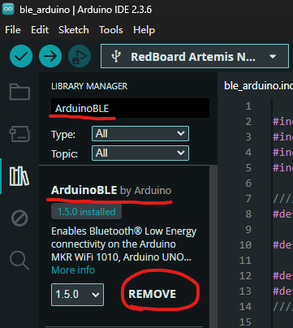
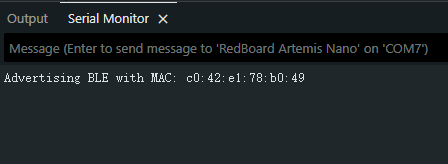
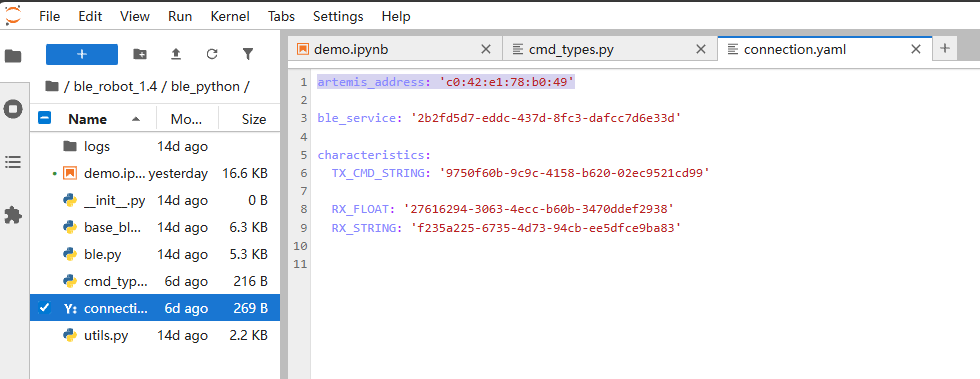
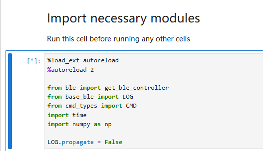
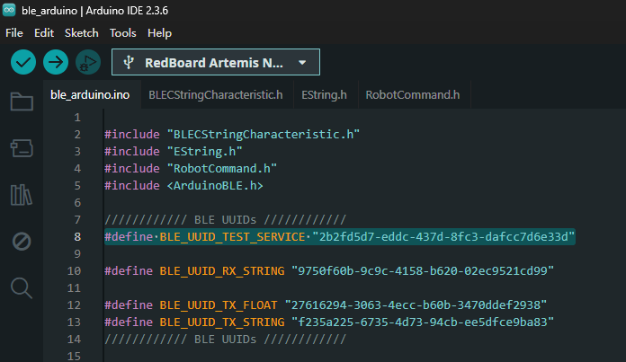
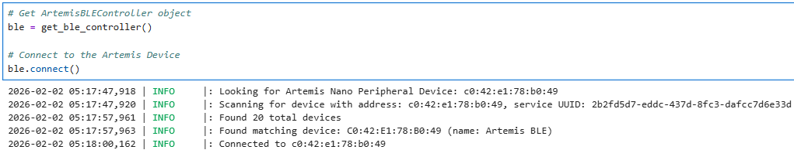

<style>
#jump-nav {
  position: fixed;
  top: 240px;    
  left: 60px;   
  width: 360px;  
  font-family: sans-serif;
  background-color: #f8f8f8;
  padding: 10px;
  border: 1px solid #ccc;
  border-radius: 5px;
}
#jump-nav a {
  display: block;
  margin: 5px 0;
  color: #333;
  text-decoration: none;
}
#jump-nav a:hover {
  text-decoration: underline;
}
</style>

<div id="jump-nav">
  <strong>Jump to:</strong>
  <a href="#lab1">Lab 1: The Artemis Board and Bluetooth</a>
  <a href="#lab2">Lab 2</a>
  <a href="#lab3">Lab 3</a>
</div>

<p align="center">
  
</p>

Hi! I'm **Siang Peng**, a senior in ECE at Cornell.<br>
This page will be used to share my coursework in Fast Robots. I hope this page can help future students better understand the requirements of these labs and provide some guidance.<br>
> ⚠️ **Note:** I am using **Windows 11**. If your system is different, check what applies to your system.

# Lab 1: The Artemis Board and Bluetooth {#lab1}

## Parts
- SparkFun RedBoard Artemis Nano × 1  
- USB-C cable × 1  

<p align="center">
  
</p>

---

## Prelab

1. Get Arduino IDE at [Arduino IDE](https://docs.arduino.cc/software/ide/)  
2. Open Arduino IDE → **File → Preferences → Additional Boards Manager URLs**  

<p align="center">
  
</p>

3. Paste the following URL in a separate line (if you have previously added other files) and save changes:  
<code>https://raw.githubusercontent.com/sparkfun/Arduino_Apollo3/main/package_sparkfun_apollo3_index.json</code>

<p align="center">
  
</p>

4. Go to **Tools → Board → Board Manager**  

<p align="center">
  
</p>

5. Search **“Apollo3”** and install **SparkFun Apollo3 Boards**  

<p align="center">
  
</p>

> Till now, we have completed all preparations for Lab 1A.

---

## Lab 1A

### Task 1: Connect Artemis board to the computer
First, I hooked the Artemis board up to my laptop. Then I clicked on port selection on the top left corner of Arduino IDE window, and clicked on the COM port that shows up. For me it is COM7; if you have trouble detecting your chip, try a different port on your device.  

<p align="center">
  
</p>

---

### Task 2: Make the built-in LED on board blink
Click **File → Examples → 01.Basics → Blink**  

A new Arduino IDE window pops up. Make sure the correct board and port are selected, then click **Upload**.  

<p align="center">
  
</p>

Now you should be able to see the built-in LED on board blinking blue.  

<!-- Video.1 placeholder -->
<p align="center">
  <!-- Replace with video when available -->
  <video width="400" controls>
    <source src="videos/video1.mp4" type="video/mp4">
    Your browser does not support the video tag.
  </video>
</p>

> If not, check if you have the correct board and port selected.

---

### Task 3: Type in the Serial Monitor
Go to **File → Examples → Apollo3 → Example4_Serial**. Click on the Serial Monitor icon on the top right corner of the Arduino IDE window.  

<p align="center">
  
</p>

Before clicking **Upload**, check if the baud rate of the Serial Monitor matches what it is defined in the script.  
> Baud rate is the number of signal changes per second; if those two do not match, you will receive **garbled text**.  

<p align="center">
  
</p>

Now type any text in the Serial Monitor, you should see it echo back like this:  

<!-- Video.2 placeholder -->
<p align="center">
  <video width="400" controls>
    <source src="videos/video2.mp4" type="video/mp4">
    Your browser does not support the video tag.
  </video>
</p>

---

### Task 4: Read temperature
Go to **File → Examples → Apollo3 → Example2_analogRead**.

> Note: by default the script uses <code>int temp_raw = analogReadTemp()</code>, which gives **raw ADC counts** from the temperature sensor.  
> **ADC value** is the number the sensor outputs after converting its voltage to a digital number.

Later in Lab 1B, we will use <code>float temp_f = getTempDegF()</code> to read **actual temperature values**.  

Now click **Upload**. You should see the Serial Monitor continuously outputting various sensor and voltage readings, including the ADC value from the temperature sensor.  

> By placing your board near the laptop **air vent**, you should see the value goes up, assuming your computer is blowing out hot air.

<!-- Video.3 placeholder -->
<p align="center">
  <video width="400" controls>
    <source src="videos/video3.mp4" type="video/mp4">
    Your browser does not support the video tag.
  </video>
</p>

---

### Task 5: Test microphone
Go to **File → Examples → PDM → Example1_MicrophoneOutput**, then click **Upload**.  

You should see the Serial Monitor continuously outputting the **loudest frequency**.  

> The white noise in the lab was quite loud, so try testing at home instead.

<!-- Video.4 placeholder -->
<p align="center">
  <video width="400" controls>
    <source src="videos/video4.mp4" type="video/mp4">
    Your browser does not support the video tag.
  </video>
</p>

## Prelab

1. Check current installed Python and pip version with terminal command:

    ```bash
    python3 --version
    python3 -m pip --version
    ```

    If `python3` does not work, try `python`, and switch all later `python3` commands into `python`:

    ```bash
    python --version
    python -m pip --version
    ```

2. Upgrade/downgrade Python to **3.10–3.13**.  
> Remember to select the **"Add Python to Path"** option in the installer.  
> **DO NOT** update to Python 3.14, there is an async issue with Bleak and the lab codebase.

3. Upgrade to the latest version of pip. In terminal, type:

    ```bash
    python3 -m pip install --upgrade pip
    ```

4. Install `venv`:

    ```bash
    python3 -m pip install --user virtualenv
    ```

5. Create a project folder for this course in a convenient location.  
For example, my folder is called `FR`. Right-click inside this folder and open the terminal. Then enter:

    ```bash
    python3 -m venv FastRobots_ble
    ```

    > A folder named `FastRobots_ble` should be created.

6. In the same terminal, enter the following to activate the virtual environment:

    ```bash
    .\FastRobots_ble\Scripts\activate
    ```

7. Your CLI prompt should now have the prefix `(FastRobots_ble)`.

<p align="center">
  
</p>

> To exit this virtual environment, enter `deactivate`. Do not do it for now.

8. To install packages inside this virtual environment, enter:

    ```bash
    pip install numpy pyyaml colorama nest_asyncio bleak jupyterlab
    ```

9. Download the Lab Codebase: [ble_robot_1.4.zip](https://fastrobotscornell.github.io/FastRobots-2026/labs/ble_robot_1.4.zip)

10. After extracting, copy the `ble_robot_1.4` folder into the same directory as `FastRobots_ble`.  
> Your project folder should now contain both folders.

11. In the terminal, enter:

    ```bash
    jupyter lab
    ```

> Make sure the virtual environment is activated. A browser tab should open up.

12. Open Arduino IDE, go to **Tools → Manage Libraries**, type `ArduinoBLE` in the search bar, and install the one published by Arduino.

<p align="center">
  
</p>

<p align="center">
  
</p>

13. Go to `project_file/ble_robot_1.4/ble_arduino`, load and upload the sketch `ble_arduino.ino` to your board.  
> You should see the MAC address of your Artemis board being printed in the Serial Monitor.

<p align="center">
  
</p>

14. In Jupyter Lab, open `connection.yaml`, replace `artemis_address` with the MAC address shown in Arduino Serial Monitor.

<p align="center">
  
</p>

15. Go to `demo.ipynb` in Jupyter Lab and run the first code cell.  
> You can press Shift+Enter to run a selected code cell.  
> Every time you restart Jupyter Lab, always remember to run this code block.

<p align="center">
  
</p>

16. Create a new code cell right below and type in the following two lines:

    ```python
    from uuid import uuid4
    uuid4()
    ```

> Run the code block and you should see your UUID.  

17. Go to `connection.yaml`, replace `ble_service` with the new UUID.

<p align="center">
  
</p>

18. In `ble_arduino.ino`, replace `BLE_UUID_TEST_SERVICE` with the new UUID.

<p align="center">
  
</p>

19. Re-upload `ble_arduino.ino` on the Artemis board.

20. Run through all the cells in `demo.ipynb`.

> Note: You **DO NOT** need to regenerate a new UUID every time you upload a new `ble_arduino.ino`, but you will need to run the above cell to reconnect.

<p align="center">
  
</p>

